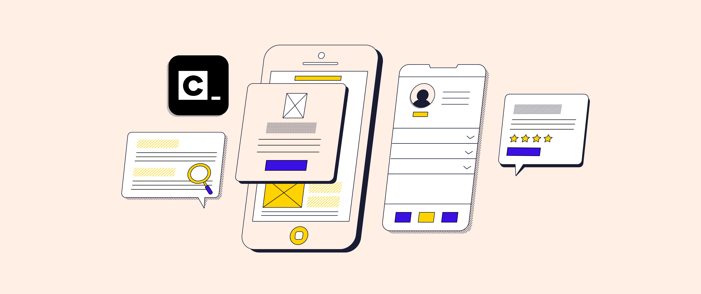

## Front-end Ontwikkeling

Welkom bij de front-end ontwikkeling bij Visie Groep! In ons front-end lokaal leren we jou de kunst en wetenschap van het ontwerpen en ontwikkelen van gebruikersinterfaces voor websites en webapplicaties. Front-end ontwikkeling omvat alles wat jij ziet en ervaart bij het gebruik van een website of een webapplicatie, van de lay-out en het ontwerp tot de interactieve elementen en de gebruikerservaring.

### Leer de basis van webdevelopment met Codecademy

Om vertrouwd te raken met de basis van webdevelopment, maken we gebruik van Codecademy, een toonaangevend online leerplatform dat interactieve cursussen biedt over een breed scala aan programmeertalen en technologieën. Voordat je begint met de cursussen op Codecademy, is het belangrijk om een account aan te maken. Hiermee kun je niet alleen je voortgang bijhouden, maar ook overal toegang krijgen tot je cursussen, zodat je kunt leren waar en wanneer het jou uitkomt.

#### HTML Cursus op Codecademy

Onze reis begint met de HTML-cursus van Codecademy. HTML, oftewel Hypertext Markup Language, is de standaardtaal voor het maken en structureren van webpagina's. In deze cursus leer jij de fundamenten van HTML, waaronder het gebruik van HTML-elementen zoals headings, paragraphs, lists en links. Je zult leren hoe je semantische en toegankelijke webpagina's kunt maken, die goed gestructureerd zijn en gemakkelijk te begrijpen voor zowel gebruikers als zoekmachines.

Voor meer informatie en om aan de HTML-cursus te beginnen, kun je de [HTML-cursus op Codecademy verkennen](https://www.codecademy.com/learn/learn-html).

#### CSS Cursus op Codecademy

Nadat je de basis van HTML hebt geleerd, gaan we verder met de CSS-cursus van Codecademy. CSS, oftewel Cascading Style Sheets, is de taal die wordt gebruikt om de visuele presentatie van webpagina's te definiëren, inclusief lay-out, kleuren, lettertypen en andere visuele aspecten. In deze cursus leer jij hoe je CSS-regels kunt gebruiken om de stijl en het uiterlijk van jouw webpagina's aan te passen en te verbeteren, waardoor ze aantrekkelijker en gebruiksvriendelijker worden.

Voor meer informatie en om aan de CSS-cursus te beginnen, kun je de [CSS-cursus op Codecademy verkennen](https://www.codecademy.com/learn/learn-css).

### Hulpmiddelen en Tips

Naast de cursussen op Codecademy zijn er nog andere handige hulpmiddelen en bronnen die je kunnen helpen bij het leren van HTML en CSS:

- **W3Schools**: Een uitgebreide online bron met tutorials, referentiehandleidingen en voorbeeldcode voor HTML, CSS en andere webtechnologieën. Je kunt het verkennen op [W3Schools](https://www.w3schools.com/).

- **FreeCodeCamp**: Een interactief leerplatform met cursussen, projecten en certificeringen voor webontwikkeling, inclusief HTML en CSS. Je kunt het verkennen op [FreeCodeCamp](https://www.freecodecamp.org/learn).

- **HTML en CSS projecten voor beginners**: Een verzameling eenvoudige projecten om de basisprincipes van HTML en CSS te leren door middel van praktische oefeningen. Je kunt deze projecten bekijken op [HTML en CSS projecten voor beginners](https://mikkegoes.com/html-and-css-projects/).

- **FontAwesome**: Een populaire bibliotheek voor pictogrammen en iconen die gebruikt kunnen worden in webontwikkelingsprojecten. Het biedt duizenden pictogrammen die je kunt toevoegen aan je website of webapplicatie. Bekijk het op [FontAwesome](https://fontawesome.com/).

- **CHATGPT handige prompts voor leren**: CHATGPT biedt nuttige prompts voor het leren van verschillende onderwerpen, waaronder programmeertalen en webontwikkeling. Deze prompts kunnen helpen bij het genereren van ideeën, het oplossen van problemen en het verkennen van nieuwe concepten. Bekijk enkele voorbeelden op de CHATGPT website.

---

*Zodra je de HTML- en CSS-cursussen hebt afgerond, meld je dit bij de werkbegeleider. Samen gaan jullie kijken naar de eerste opdracht om je vaardigheden in de praktijk te brengen. Je kunt de [opdracht-directory in onze GitHub-repository](../~Opdracht-1) bekijken om aan de slag te gaan.*

