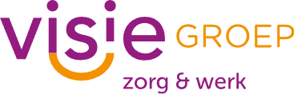

# Welkom bij Visie Groep!

Welkom bij de GitHub-repository van Visie Groep! Wij zijn een dagbesteding die mensen leert coderen in onze twee lokalen: front-end en back-end.

## Front-end Ontwikkeling
In het front-end lokaal werken we met HTML, CSS en JavaScript om boeiende gebruikersinterfaces te ontwerpen en ontwikkelen. Hier leren onze deelnemers de basisprincipes van webontwikkeling en hoe ze aantrekkelijke en responsieve websites kunnen bouwen.

Voor opdrachten en projecten met betrekking tot front-end ontwikkeling, bekijk de map [Front-end Opdrachten](Frontend/).

## Back-end Ontwikkeling
In het back-end lokaal richten we ons voornamelijk op PHP en C#, maar we gebruiken ook talen zoals Python en Java voor de ontwikkeling van krachtige en schaalbare serverapplicaties. Hier leren onze deelnemers hoe ze de logica en functionaliteit achter websites en webapplicaties kunnen bouwen en beheren.

Voor opdrachten en projecten met betrekking tot back-end ontwikkeling, bekijk de map [Back-end Opdrachten](Backend/).

Deze repository is een centrale verzamelplaats voor al onze opdrachten, handig onderverdeeld in front-end en back-end, om je te helpen bij het navigeren door ons curriculum.

Dus, welkom aan boord en laten we samen aan de slag gaan om je programmeervaardigheden naar nieuwe hoogten te tillen!
